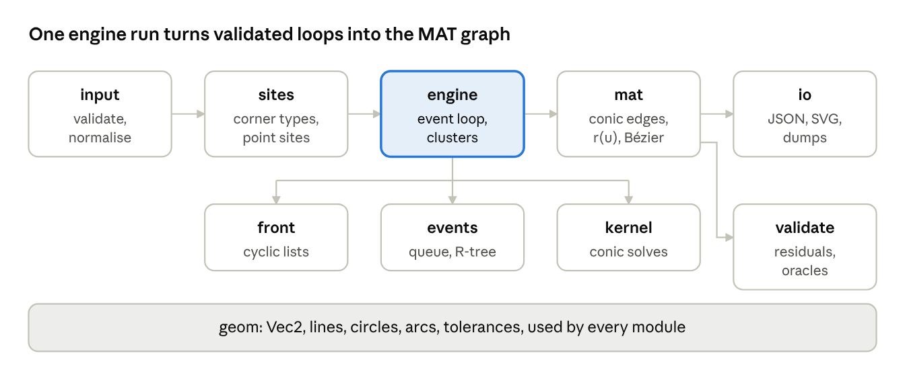

**Revision history**

| Version | Date | Status | Changes |
| --- | --- | --- | --- |
| 1.4 | 2026-10-09 | minor revision | EV-11, EV-12, RB-01: the windowed broad phase as implemented in M6 (window choice, split candidates, event identity in the queue order); PF-01: heap compaction rule; PF-02: times measured in M6; VER-07: benchmark families |
| 1.3 | 2026-10-09 | minor revision | EV-04: a circle front can also reach a regular vertex; RB-02, RB-03: cluster radius, port ordering and vertex kinds as implemented in M5; RB-04 and API: `resolve_all_events` option for the cross-check |
| 1.2 | 2026-10-09 | minor revision | API-03: error code `unsupported` for valid input that a later milestone handles |
| 1.1 | 2026-10-09 | minor revision | VER-01 and M1: kernel fixtures generated with SymPy instead of Maple |
| 1.0 | 2026-10-09 | approved baseline | content of 0.2 approved by michael as the implementation baseline; sources moved to `docs/` in the wfmat repository, which is now the master copy; tagged `spec-v1.0` |
| 0.2 | 2026-10-09 | preliminary draft | requirement identifiers added to every normative statement; requirements index (appendix A); tests cite the IDs they verify |
| 0.1 | 2026-10-09 | preliminary draft | first complete draft; scope decisions of 2026-10-08 applied (single loop, interior MAT, C++20, bulge JSON input) |

**Requirement identifiers.** Every normative statement carries an identifier of the form **[AREA-nn]**, where AREA is one of SC (scope), IN (input), OUT (output), ALG (algorithm), EV (events), KN (kernel), RB (robustness), PF (performance), API, LIB (libraries and build) and VER (verification). Identifiers are permanent: a withdrawn requirement keeps its number, marked withdrawn, and numbers are never reused. Every test names the identifiers it verifies as Catch2 tags, for example `[IN-04]`. Appendix A lists all identifiers.

## 1. Overview and scope

We compute the exact medial axis transform (MAT) of a planar region bounded by line segments and circular arcs by simulating the inward grassfire: the boundary offset front is propagated as a kinetic data structure, and every MAT edge is the trajectory of a front corner (a shock). Time equals offset distance, so the radius function falls out for free: a point traced at time $t$ has radius $r = t$.

**Goals**

- **[SC-01]** Input: one closed loop of line segments and circular arcs bounding a simply connected region, as C++ objects or a JSON file.
- **[SC-02]** Output: the full interior MAT as a planar graph. Each edge is an exact conic arc (line, parabola, ellipse or hyperbola branch) with closed-form position $p(r)$, radius $r$, and the two boundary contact points as functions of $r$.
- **[SC-03]** Exact handling of the degeneracies that dominate CAD data: parallel lines, concentric arcs, tangent ($G^1$) joins, cocircular contacts and symmetric shapes.
- **[SC-04]** C++20, permissively licensed dependencies only, deterministic results, no global state.

**Non-goals for v1**

- Holes (planned for v2), the exterior MAT, free-form curves (splines, NURBS), external file readers such as DXF, 3D, and pruning or simplification of the axis (offered later as post-processing on the output graph).
- Exact (algebraic) arithmetic. We use double precision with tolerance-controlled topology and extended-precision refinement of event times (section 8).

**Why wavefront.** Unlike an incremental Voronoi construction, the front simulation yields MAT edges already ordered by radius, produces offset curves as a by-product, and handles arcs natively because offsets of lines and circles stay lines and circles. Its weak points are event detection for non-adjacent front pieces and simultaneous events; sections 6 to 8 address both.

## 2. Mathematical model

Every boundary piece becomes a site with a signed distance function that is linear (lines) or a shifted Euclidean norm (circles), so every bisector is a conic and every event is the root of at most a quadratic.

**Region and MAT.** $\Omega$ is a bounded open region with boundary $\partial\Omega$, and $d(x) = \operatorname{dist}(x, \partial\Omega)$. The MAT is the pair $(M, r)$: $M$ is the closure of the set of centres of maximal inscribed disks, and $r(x) = d(x)$ on $M$. $M$ is a finite graph homotopy-equivalent to $\Omega$, so for the simply connected regions of v1 it is a tree.

**Sites.** Each input segment is a site. Each reflex corner (a right turn when walking the boundary with $\Omega$ on the left) adds a point site at the corner. For $x$ in a site's zone, its distance function is

$$
d_L(x) = n \cdot x - c, \qquad \lVert n \rVert = 1,\ n \text{ pointing into } \Omega \qquad \text{(line)}
$$

$$
d_C(x) = \sigma\,\bigl(R - \lVert x - c \rVert\bigr), \qquad \sigma = +1 \text{ convex},\ \ \sigma = -1 \text{ concave} \qquad \text{(circle)}
$$

A convex arc has its centre on the $\Omega$ side; a concave arc bulges into $\Omega$; a point site is a concave circle with $R = 0$.

**Front.** $F(t) = \{\, x \in \Omega : d(x) = t \,\}$. Each front element is the live part of an offset site: a line $n \cdot x = c + t$, or a circle of radius $R - \sigma t$ about the same centre. A convex circle element dies no later than $t = R$.

**[ALG-01] Corner classification.** At each junction of consecutive segments $a$ and $b$, let $\varphi$ be the signed turning angle from the end tangent of $a$ to the start tangent of $b$, with $\Omega$ on the left.

| Turning angle $\varphi$ | Corner | Front vertex at $t = 0$ |
| --- | --- | --- |
| $\varphi > \varepsilon_{\text{ang}}$ | convex | shock vertex; a MAT edge starts at the corner with $r = 0$ |
| $\lvert\varphi\rvert \le \varepsilon_{\text{ang}}$ | tangent ($G^1$) | regular vertex; moves along the shared normal, traces nothing |
| $\varphi < -\varepsilon_{\text{ang}}$ | reflex | point site inserted between $a$ and $b$, flanked by two regular vertices |
| $\lvert\varphi\rvert \ge \pi - \varepsilon_{\text{ang}}$ | cusp | excluded by the input contract; validation rejects it as a safeguard |

**Bisectors.** A shock vertex between sites $A$ and $B$ traces the locus $d_A = d_B$, a conic:

| Site pair | Bisector | Remarks |
| --- | --- | --- |
| line, line | line | angle bisector; parallel facing lines give a plateau (constant $r$) |
| line, circle (any $\sigma$, incl. point) | parabola | focus at the circle centre |
| convex, concave circle | ellipse | foci at both centres, $\lVert x-c_1\rVert + \lVert x-c_2\rVert = R_1 + R_2$ |
| convex, convex or concave, concave | hyperbola branch | $\lVert x-c_1\rVert - \lVert x-c_2\rVert = R_1 - R_2$; a line when $R_1 = R_2$ |
| point, point | line | perpendicular bisector |

**Kinematics.** Every regular point of the front moves along its normal at unit speed. A shock vertex whose front corner has interior angle $\alpha$ moves at speed $1/\sin(\alpha/2)$. Hence the front is 1-Lipschitz in time in the Hausdorff metric: two front pieces at distance $\delta$ at time $t$ cannot meet before $t + \delta/2$. This bound drives non-local event scheduling (section 6).

**MAT vertex kinds.** Corner (degree 1, $r = 0$, at a convex boundary corner); curvature end (degree 1, $r = R$, at a convex arc centre); junction (degree $\ge 3$, three or more contacts); transition (degree 2, a contact passes from a site to its tangent or reflex neighbour, so the conic type changes); extremum (degree 2, a local minimum of $r$ where two fronts first touch, or a local maximum where two shocks annihilate).

## 3. Input specification

The input is a region given as a single closed chain of lines and arcs in bulge form; it is validated, oriented and normalised before any propagation starts.

**[IN-01] Representation.** A loop is a cyclic list of vertices $(x, y, \beta)$ with bulge $\beta$. The segment from vertex $i$ to $i+1$ is a line when $\beta = 0$, otherwise a circular arc with $\beta = \tan(\theta/4)$, $\theta$ the signed sweep (the DXF LWPOLYLINE convention). Bulge form guarantees closure and $G^0$ continuity by construction. A single full circle is a loop of two half-arcs ($\beta = \pm 1$ each). An explicit (centre, radius, start angle, sweep) form is also accepted and converted.

**[IN-02] JSON schema (v1)**

```json
{
  "units": "mm",
  "outer": [[0,0,0],[100,0,0],[100,40,1],[60,40,0],[0,40,0]]
}
```

**Validation rules (reject with a diagnostic naming the loop and segment)**

1. **[IN-03]** Every segment has length $> \varepsilon_{\text{len}}$; every arc has $\lvert\theta\rvert \in (\varepsilon_{\text{ang}}, 2\pi)$.
2. **[IN-04]** The loop is simple: no segment pair intersects except consecutive segments at their shared vertex. Checked with an R-tree broad phase and exact line/arc intersection tests.
3. **[IN-05]** Exactly one loop; input with holes is rejected with a diagnostic saying holes arrive in v2.
4. **[IN-06]** No cusp corners (section 2 table). The data contract excludes them; the check is a safeguard.

**Normalisation**

1. **[IN-07]** Translate the bounding-box centre to the origin and scale by $1/L$, $L$ the half-diagonal, so all coordinates lie in $[-1, 1]$. All tolerances are relative to this unit frame; output is mapped back by the inverse transform, radii by $L$.
2. **[IN-08]** Orient the loop counter-clockwise (signed area via the shoelace formula plus the arc segment areas), so $\Omega$ is on the left.
3. **[IN-09]** Merge consecutive collinear lines and consecutive co-circular arcs (same centre and radius within $\varepsilon_{\text{geom}}$). This removes spurious transition vertices.
4. **[IN-10]** Snap near-tangent joins ($\lvert\varphi\rvert \le \varepsilon_{\text{ang}}$) to exact tangency and record them as $G^1$.

**[IN-11] Tolerances (defaults, unit frame, all configurable)**

| Name | Default | Meaning |
| --- | --- | --- |
| $\varepsilon_{\text{geom}}$ | $10^{-10}$ | coincidence of points and of site parameters |
| $\varepsilon_{\text{len}}$ | $10^{-9}$ | minimum segment length |
| $\varepsilon_{\text{ang}}$ | $10^{-9}$ rad | tangent and cusp detection |
| $\varepsilon_{t}$ | $10^{-11}$ | event-time clustering |

## 4. Output specification

The MAT is returned as an embedded graph whose edges are parametrised by radius: every edge is the trajectory of one shock over a time interval, so $r$ increases monotonically along it from its birth vertex to its death vertex, and $r(p)$ is exact everywhere.

**Graph**

- **[OUT-01]** Vertices: position $p$, radius $r$, kind (section 2), and the list of contacts (site id plus foot point). Incident edges are stored in counter-clockwise order.
- **[OUT-02]** Edges: birth vertex $v_0$ at $r_0$, death vertex $v_1$ at $r_1 > r_0$, and the two sites (left, right) seen from the direction of travel. Plateau edges ($r_0 = r_1$) are flagged and parametrised by arc length instead.
- **[OUT-03]** Global: the site table (original segment index, kind, geometry), the normalisation transform, and per-run statistics (event counts by type, clusters resolved, maximum residual).

**[OUT-04] Edge geometry.** Each edge stores its conic type, the data needed to evaluate it in closed form, and a branch selector fixed at birth:

$$
p(r) = \operatorname{shock}(A, B, r), \quad r \in [r_0, r_1], \qquad f_A(r) = p(r) - r\,\nabla d_A\bigl(p(r)\bigr)
$$

$f_A$ and $f_B$ are the contact (foot) points on the two sites; the inscribed disk of radius $r$ at $p(r)$ touches the boundary exactly there.

**[OUT-05] Evaluation API.** For every edge: position, radius, unit tangent, both feet at a given $r$; arc-length sampling; adaptive flattening to a polyline within a chord tolerance; and exact export as a rational quadratic Bézier (every conic arc has one), with $r$ supplied as a separate per-edge function since it is not polynomial in the Bézier parameter.

**[OUT-06] Formats.** C++ object graph (primary), JSON (vertices, edges, conic parameters, sampled polylines), and SVG for inspection, showing the boundary, MAT edges coloured by $r$ and optional inscribed disks.

**Guarantees (checked by the validator in section 12)**

- **[OUT-07]** For every sampled point $p$ on an edge, $\lvert d(p) - r\rvert \le \varepsilon_{\text{res}}$ and at least two distinct feet exist, except at degree-1 vertices.
- **[OUT-08]** The graph is a tree: connected, with no cycles.
- **[OUT-09]** The union of the inscribed disks reproduces $\Omega$ to within the sampling tolerance.
- **[OUT-10]** Same input, same output, bit for bit, on the same platform and build.

## 5. Algorithm: wavefront propagation

The front is a set of cyclic doubly linked lists of elements and vertices, advanced from event to event by a priority queue keyed on time; between events nothing changes combinatorially and every vertex moves on a known conic, so the simulation is exact up to root evaluation.

**[ALG-02] Front data structure**

- Element: the site it offsets, prev and next vertex, and a version counter bumped whenever either neighbour changes. Its live part at time $t$ is the arc of the offset between its two vertices.
- Vertex: kind (shock or regular), left and right element, birth time and point, branch selector, and for shocks the id of the MAT edge being traced.
- Loop: entry element and element count. A loop with no vertices (a full circle offset) is allowed.
- Pools: elements, vertices and events live in index-addressed vectors with free lists; ids are stable 32-bit integers, which keeps the structure cache-friendly and makes runs deterministic.

**[ALG-03] Initialisation**

1. Build sites from the normalised loop; classify each corner (section 2).
2. Create one element per site in boundary order, inserting a zero-length point-site element at every reflex corner.
3. Create a vertex at every junction: a shock at convex corners (its MAT edge starts at a corner vertex, $r = 0$), a regular vertex at tangent and reflex joins.
4. Schedule the local event of every element and seed non-local candidates (section 6).

**[ALG-04] Main loop**

```cpp
while (auto ev = queue.pop_valid()) {          // skips events whose version stamps are stale
    Cluster c = gather_cluster(*ev, queue);   // all valid events within eps_t and eps_geom of ev
    if (c.size() == 1) handle_simple(*ev);    // section 6 handlers
    else               resolve_cluster(c);    // section 8, generic topological resolution
    for (Element e : touched_elements)        // only elements whose neighbourhood changed
        reschedule(e);                        // local event plus non-local candidates
}
finalize_open_edges();                        // all loops empty; every MAT edge has both ends
```

**[ALG-05] Termination.** Every event creates at least one MAT vertex and the MAT has $O(n)$ vertices, so there are $O(n)$ events. The simulation ends when every loop is empty, at $t = \max r$, the radius of the largest inscribed disk.

**[ALG-06] By-product.** Snapshotting the front at any $t$ yields the exact inward offset curve of $\Omega$ at distance $t$ as lines and arcs, at no extra cost.

## 6. Events and handlers

Three generic event types produce every MAT vertex: a local collapse, a non-local split, and a non-local contact; everything else (loop annihilation, high-degree junctions, plateaus) is a coincidence of these and goes to cluster resolution in section 8. Below, $A\mid B$ denotes the front vertex between elements $A$ and $B$.

| Event | Trigger | Time from | MAT vertex | Front update |
| --- | --- | --- | --- | --- |
| **[EV-01]** E1a collapse, shock + shock | element $B$ between $A\mid B$ and $B\mid C$ shrinks to a point | 3-site solve $(A,B,C)$ | junction, 3 contacts | remove $B$; new vertex $A\mid C$ |
| **[EV-02]** E1b collapse, shock + regular | shock $A\mid B$ reaches the junction of $B$ with its tangent or reflex neighbour $C$ | bisector $(A,B)$ meets the junction's normal ray | transition | remove $B$; shock continues as $A\mid C$, edge changes conic |
| **[EV-03]** E1c collapse, regular + regular | convex arc $B$ shrinks to its centre ($t = R$) | closed form | curvature end | remove $B$; new shock $A\mid C$, edge born with $r = R$ |
| **[EV-04]** E2 split | shock $A\mid B$ reaches the interior of a non-adjacent element $C$; with circle fronts, $C$ can also reach a regular vertex $A\mid B$ inside its live part | 3-site solve $(A,B,C)$; for a regular vertex, the hit time of [KN-04] | junction, 3 contacts; extremum (min of $r$) for a regular vertex, which traces no edge | split $C$ into $C_1, C_2$; new shocks $A\mid C_2$ and $C_1\mid B$; split the loop |
| **[EV-05]** E3 contact | non-adjacent elements $A$ and $C$ become tangent | common normal; $t$ = half the gap | extremum (min of $r$) | split $A$ and $C$; two new shocks moving apart; split the loop |

**Rules shared by all handlers**

- **[EV-06]** A new vertex between elements $X$ and $Y$ is a shock if $X$ and $Y$ meet at a corner, and regular if they meet tangentially (only possible when they are original $G^1$ neighbours).
- **[EV-07]** Every shock that dies closes its MAT edge at the event vertex; every new shock opens one there.
- **[EV-08]** A loop that drops to two elements both shrinking to one point, or to one element with no vertices (a circle reaching zero radius), is annihilated: its last vertex is an extremum (max of $r$) or a curvature end.
- **[EV-09]** Without holes, E2 and E3 always split a loop and never merge two, which is why the v1 MAT is a tree. Loop merges arrive with holes in v2.

**[EV-10] Local event scheduling.** Each element keeps at most one pending collapse event, recomputed in $O(1)$ whenever its version changes. Stale events are not removed from the heap; they are discarded at pop time by comparing version stamps (lazy deletion).

**[EV-11] Non-local event scheduling.** Split and contact candidates come from a windowed broad phase that relies on the Lipschitz bound of section 2: a live front piece at time $t + \Delta$ lies within $\Delta$ of the same piece at time $t$.

1. A window $[t_k,\, t_k + \Delta_k]$ opens when the next queued event lies beyond the current one, at the end of the previous window. The box of every live element at $t_k$ (its two ends, and the extreme points of an arc between them), inflated by $\Delta_k$, goes into an R-tree.
2. For each overlapping pair of non-adjacent elements, compute exact E2 and E3 candidates in $(t_k,\, t_k + \Delta_k]$ with the kernel, and enqueue the valid ones. A shock reaching element $c$ moves along both of its elements, so a split is a candidate only when both of their boxes meet the box of $c$. Roots outside the window are left to the window that contains them.
3. $\Delta_0$ is the median distance from an element's box to the nearest box of a non-adjacent element, or the median box diagonal when that median is zero. A window doubles when the previous one found fewer than 8 candidate pairs per live element or handled fewer events than a quarter of the live elements, and halves when it found more than 64 pairs per element.
4. When a handler creates or reshapes an element inside the window, query the current R-tree for it immediately, so no candidate is missed. A new element enters the R-tree with its box from now to the end of the window.

Cluster resolution [RB-03] and loop relabelling after a split [EV-09] use the same R-tree, so an event costs time for its neighbourhood rather than for its whole loop.

**[EV-12]** A debug mode (`BroadPhase::all_pairs`) replaces the broad phase with all pairs and an unbounded window; the two must produce identical event sequences, bit for bit, which is a standing regression test. Contact candidates are always formed with the lower element id first, so a pair has one orientation whichever element asked for it.

**[EV-13] Validity at pop time.** A candidate is accepted only if every involved element and vertex still has the version it was computed with and every contact foot lies inside the live part of its element at the event time (closed intervals, $\varepsilon_{\text{geom}}$ slack). Feet that land exactly on a vertex are handed to cluster resolution.

## 7. Geometric kernel

All event and trajectory computations reduce to one small solver in the unknowns $z = (x, y, t)$. Line sites give linear equations and circle sites give quadratics that share the same quadratic form, so any three sites reduce to two linear equations plus one quadratic in one parameter.

**Site equations.** Squaring the circle equation gives

$$
\lVert x \rVert^2 - t^2 - 2\,c \cdot x + 2\sigma R\, t + \lVert c \rVert^2 - R^2 = 0 \quad \text{(circle)}, \qquad n \cdot x - t - c = 0 \quad \text{(line)}
$$

Every circle shares the quadratic part $Q(z) = x^2 + y^2 - t^2$ (the Minkowski form of Laguerre geometry), so the difference of two circle equations is linear in $z$.

**[KN-01] Three-site solve (E1a, E2).** Pick one circle as the pivot (if any) and subtract it from the other circle equations; with the line equations this gives a $2 \times 3$ linear system. Its solutions form a line $z = z_0 + s\,w$, with $w$ the cross product of the two rows. Substituting into the pivot gives

$$
Q(w)\, s^2 + b\, s + c = 0,
$$

solved with the cancellation-free quadratic formula (linear when $Q(w) \approx 0$). With three lines the $3 \times 3$ system has a unique solution. Each root is accepted only if:

- $t \ge t_{\text{now}} - \varepsilon_t$, and $R - \sigma t \ge -\varepsilon_{\text{geom}}$ for every circle (squaring admits negative radii);
- the point is on the correct side of each site ($d_i(x) = t$ with the original sign);
- every foot lies inside the live part of its element at $t$.

**[KN-02]** The earliest accepted root wins. A rank-deficient system (parallel lines, concentric circles, collinear centres with equal radii) is reported as degenerate and routed to section 8.

**[KN-03] Shock position (two sites, fixed $t$).** The two offset curves intersect in at most two points, symmetric about the pair's axis (the centre line, or the perpendicular from a centre to a line). A branch selector, the sign of $u \times (p - o)$ with $u$ the axis direction and $o$ the axis origin, is fixed at the shock's birth. Both roots coincide only at a tangency, which is always an E3 or annihilation event, so the selector never changes along an edge. Line-line shocks are affine in $t$.

**[KN-04] Regular vertices.** $q(t) = q_0 + t\,m$, where $m$ is the inward normal at the tangent join. The E1b time solves $d_A(q_0 + t\,m) = t$: linear for a line $A$, quadratic for a circle $A$.

**[KN-05] Contact (E3).** Two elements first touch along a common normal (a double normal):

| Pair | Common normal | Contact time |
| --- | --- | --- |
| line, line | exists only if antiparallel | $t^* = g/2$ along the whole overlap: plateau |
| line, circle | perpendicular from the centre to the line | $t^* = g/2$ along that perpendicular; up to two candidates |
| circle, circle | the centre line | $t^* = g/2$ along it; concentric circles give a plateau |

Here $g$ is the gap between the two sites measured along the common normal. A candidate is valid if both feet are live at $t^*$ and the fronts approach each other just before $t^*$ (their normals are opposed along the common normal).

**[KN-06] Precision.** All solves run in double. When the discriminant is small relative to its terms (near-tangency) or the $2 \times 3$ system is ill-conditioned, the root is refined by Newton iteration on the original unsquared equations in binary128, and its condition estimate is stored with the event for the clustering logic.

## 8. Robustness and degeneracies

Degenerate configurations are the normal case in CAD data (rectangles, slots, regular polygons), so they are not perturbed away; simultaneous events are merged into clusters and resolved by one generic topological procedure that subsumes every special case.

**[RB-01] Event ordering.** The queue orders by $(t,\ \text{kind},\ \text{smallest involved element id})$, then by the rest of the event's identity (its elements, its vertex and their versions), so that the order never depends on when an event was found. Ties are therefore deterministic, and no hash-ordered container is ever iterated on a path that affects output.

**[RB-02] Cluster formation.** When an event is popped at $(t^*, p^*)$, every other valid event with $\lvert t - t^*\rvert \le \varepsilon_t$ whose point lies within the cluster radius $\rho = 10\,\varepsilon_{\text{geom}}$ of a point already in the cluster joins it (a breadth-first search over a grid of cells of size $\rho$, linear in the number of events). A plateau contributes its whole overlap segment or arc instead of a point. Repeats of one event are dropped; a cluster of one event goes to its simple handler.

**[RB-03] Cluster resolution**

1. Region. Take the cluster's points, or plateau segment, and grow it by $\rho$ into a small region $D$. Its anchors are the mean of the event points, or the two ends of the plateau.
2. Kill. Every element whose live part at $t^*$ lies inside $D$ dies. Every shock with its position in $D$ dies and closes its MAT edge at the cluster vertex.
3. Chains. The surviving front near $D$ falls into $k$ chains; each enters $D$ through a last surviving element $e_{\text{in}}$ and leaves through a first surviving element $e_{\text{out}}$.
4. Relink. Sort the ports ($e_{\text{in}}$ and $e_{\text{out}}$ of every chain) counter-clockwise around $D$ by the direction in which their front leaves the anchor, and fronts tangent there by their curvature. The region near $D$ lies counter-clockwise of an $e_{\text{out}}$ and clockwise of an $e_{\text{in}}$, so each $e_{\text{in}}$ links to the $e_{\text{out}}$ just before it. Each link is a new vertex, shock or regular by the corner rule, and a shock opens a new MAT edge moving into the sector between the two.
5. Emit. One MAT vertex at each anchor with $r = t^*$, its contacts the union of the sites touching it; for a plateau, a constant-radius edge joins the two. The vertex kind follows from its degree: three or more edges make a junction; two make a maximum (two shocks ending), a minimum (two starting) or a transition (one of each, or a plateau and one shock); one or none make a curvature end.
6. Rebuild loops by walking the relinked lists: $k = 0$ annihilates a loop.

**[RB-04]** The simple handlers in section 6 are the special cases $k = 1$ (collapse) and $k = 2$ (split, contact); they are cross-checked against this procedure by a debug option, `Options::resolve_all_events`, that sends every event through it, and the test suite requires the same axis either way.

**Typical clusters**

| Shape | What coincides | Result |
| --- | --- | --- |
| Rectangle | two corner shocks per end and the long-side contact | two junctions joined by a plateau edge |
| Regular $n$-gon | $n$ collapses at the centre | one vertex of degree $n$ |
| Disk | a loop with no vertices | one point |
| Slot (two semicircles, two lines) | both arcs reach their centres as the lines meet | plateau edge between two curvature ends |

**[RB-05] Near-degeneracy.** Events closer than $\varepsilon_t$ in time but farther than $\varepsilon_{\text{geom}}$ apart are processed separately, in order. They can emit very short edges; those are kept, since they are correct, and an optional post-processing step can contract edges shorter than a user threshold.

**[RB-06] Invariants checked after every event** (all in debug builds, the $O(1)$ local ones in release): loops are closed and consistently oriented; every element has a non-negative live length ($\ge -\varepsilon_{\text{geom}}$); every shock has a finite speed; MAT edges are opened and closed in pairs. A violation aborts the run with a diagnostic dump of the front (JSON and SVG) and the event history. The library never returns a MAT it knows to be inconsistent.

## 9. Complexity and performance targets

**[PF-01]** With $n$ input segments the MAT has $O(n)$ vertices and edges, so the simulation processes $O(n)$ events; local work is $O(\log n)$ per event, and the expected total is $O(n \log n)$ for typical inputs, with an $O(n^2)$ worst case confined to the non-local broad phase.

| Part | Cost | Notes |
| --- | --- | --- |
| Validation | $O(n \log n)$ expected | R-tree broad phase, exact pair tests |
| Local events | $O(n \log n)$ | $O(1)$ kernel solve plus a heap operation each |
| Non-local candidates | $O(n \log n)$ typical, $O(n^2)$ worst | windowed R-tree; worst case is many long, nearly parallel fronts |
| Cluster resolution | $O(m \log m)$ per cluster of $m$ events | sum over clusters is $O(n \log n)$ |
| Memory | $O(n)$ | pools of elements, vertices and events; stale events dropped by a heap compaction whenever the heap has doubled since the last one |

**[PF-02] Targets (single thread, release build, a current desktop CPU)**

| Input size | Target time |
| --- | --- |
| 1,000 segments | under 5 ms |
| 10,000 segments | under 60 ms |
| 100,000 segments | under 1 s |

Measured in M6 (release build, one core of the CI-class cloud machine, `compute_mat` on a prepared region; the benchmark suite reports `prepare` separately):

| Family (VER-07) | 1,000 segments | 10,000 segments |
| --- | --- | --- |
| Filleted star (random fillets) | 17 ms | 1.3 s |
| Wavy outline (smooth star) | 80 ms | 0.6 s |
| Spiky star | 120 ms | 15 s |
| Gear | 530 ms | over 15 s |

The broad phase meets the identical-sequence requirement [EV-12] but not these targets: the boxes of neighbours on the same smooth curve overlap in every window, and fronts that converge on one point (gears, regular polygons) make every pair a candidate. Closing the gap is follow-up work.

The targets are budgets for v1 to be measured against, not results; the benchmark suite in section 12 tracks them. Parallelism is out of scope for v1, because the event order is inherently sequential; batch processing of many shapes is parallel by construction, since runs share no state.

## 10. Software architecture and C++ API

**[API-01]** The library, `wfmat`, is a layered set of small modules with one public entry point, `compute_mat`; the geometric kernel is pure and stateless, and all mutable state lives in one engine object per run.



Data flows left to right; the engine owns the front and the event queue and calls the kernel for every event time and trajectory, which `mat` reuses for exact edge evaluation.

**[API-02] Public API (sketch)**

```cpp
namespace wfmat {

struct Vec2 { double x, y; };
struct BulgeVertex { Vec2 p; double bulge; };          // bulge = tan(sweep / 4)
struct Loop   { std::vector<BulgeVertex> vertices; };
struct Region { Loop outer; };                         // holes: v2

struct Tolerances { double geom = 1e-10, len = 1e-9, ang = 1e-9, time = 1e-11; };
enum class BroadPhase { windowed_rtree, all_pairs };
struct Options {
    Tolerances tol;
    BroadPhase broad_phase = BroadPhase::windowed_rtree;
    bool       debug_checks = false;                   // full invariants after every event
    bool       resolve_all_events = false;             // [RB-04] every event through cluster resolution
};

enum class VertexKind { corner, curvature_end, junction, transition, extremum_min, extremum_max };
enum class ConicKind  { line, parabola, ellipse, hyperbola, plateau_line, plateau_arc };

using SiteId = std::uint32_t; using VertexId = std::uint32_t; using EdgeId = std::uint32_t;
struct Contact   { SiteId site; Vec2 foot; };
struct MatVertex { Vec2 p; double r; VertexKind kind;
                   std::vector<Contact> contacts; std::vector<EdgeId> edges; };  // edges CCW

class MatEdge {
public:
    VertexId  v0() const;  VertexId v1() const;        // birth, death; r(v0) <= r(v1)
    SiteId    left() const; SiteId right() const;
    ConicKind kind() const;
    double r0() const; double r1() const;
    Vec2 point(double r) const;                        // not for plateau edges
    Vec2 point_at(double u) const;                     // u in [0, 1], all edges
    double radius_at(double u) const;
    Vec2 tangent_at(double u) const;
    std::pair<Vec2, Vec2> feet_at(double u) const;     // contact points on left, right
    RationalQuadBezier bezier() const;                 // exact conic arc
    void flatten(double chord_tol, std::vector<Vec2>& out) const;
};

class MedialAxis {
public:
    std::span<const MatVertex> vertices() const;
    std::span<const MatEdge>   edges() const;
    std::span<const Site>      sites() const;          // maps back to input segments
    const RunStats&            stats() const;
};

Result<MedialAxis> compute_mat(const Region&, const Options& = {});
Result<std::vector<Loop>> inward_offset(const Region&, double distance, const Options& = {});

} // namespace wfmat
```

**[API-03]** `Result<T>` is `tl::expected<T, Error>`, keeping the C++20 baseline (it maps directly onto `std::expected` if the project later moves to C++23); `Error` carries a code (`invalid_input`, `numerical_failure`, `invariant_violation`, or `unsupported` for valid input that the current milestone does not yet handle, with the milestone that will in the error's requirement field), the offending loop and segment, and the path of the diagnostic dump if one was written. All output coordinates and radii are in the caller's units; normalisation is internal. A command-line tool, `wfmat-cli`, wraps `compute_mat` for JSON in, JSON and SVG out.

## 11. Libraries and licensing

**[LIB-01]** The core needs only the C++20 standard library plus three header-only Boost components; everything else is confined to I/O, tests and benchmarks, and every dependency is public domain or permissively licensed (BSL-1.0, MIT, Apache-2.0).

| Library | License | Used for | Scope |
| --- | --- | --- | --- |
| C++20 standard library | n/a | containers, `span`, `variant`, `<numbers>` | core |
| Boost.Geometry (`index::rtree`) | BSL-1.0 | broad phase, input validation | core |
| Boost.Multiprecision (`cpp_bin_float_quad`) | BSL-1.0 | binary128 root refinement, portable across compilers | core |
| Boost.Math (`toms748_solve`) | BSL-1.0 | bracketed root fallback when Newton stalls | core |
| `tl::expected` | CC0 (public domain) | `Result` type on the C++20 baseline | core |
| nlohmann/json | MIT | JSON input and output | io |
| Catch2 v3 | BSL-1.0 | unit and property tests | tests |
| Boost.Polygon (`voronoi`) | BSL-1.0 | independent oracle for polygonal inputs | tests |
| Google Benchmark | Apache-2.0 | performance suite | bench |

**[LIB-02] Deliberately not used.** CGAL's Segment Delaunay Graph and Apollonius Graph packages are GPL-3.0 or commercial; OpenVoronoi is LGPL-2.1; VRONI and ArcVRONI are not openly licensed. Eigen (MPL-2.0) is unnecessary for $2 \times 3$ systems.

**[LIB-03] Build.** CMake 3.25 or newer, dependencies through a vcpkg manifest with a FetchContent fallback, tested on GCC 12+, Clang 15+ and MSVC 19.36+. The library compiles with `-ffp-contract=off` (and `/fp:precise` on MSVC) and never with fast-math, because fused multiply-add changes rounding and would break bit-for-bit determinism.

## 12. Verification and test plan

Every test cites the requirement identifiers it verifies. Correctness is established at three levels: the kernel against closed-form answers, whole MATs against shapes with known axes and against an independent oracle, and every run against the defining property of the MAT.

**[VER-01] Kernel unit tests.** Every site pair and triple type (line, convex arc, concave arc, point) for the three-site solve, shock trajectories and contact times, compared with exact symbolic results (generated once with SymPy, `tools/fixtures/gen_kernel_fixtures.py`, and stored as fixtures). Near-tangent and ill-conditioned cases check the binary128 refinement.

**[VER-02] Canonical shapes with known MAT**

| Shape | Expected axis |
| --- | --- |
| Disk | one point, $r = R$ |
| Rectangle $a \times b$ | four $45^\circ$ segments and a plateau of length $a - b$ at $r = b/2$ |
| Equilateral triangle, regular $n$-gon | $n$ segments meeting at the centre, degree $n$ |
| Slot (stadium) | one plateau edge between the arc centres, $r = R$ |
| L-shape | reflex corner gives two parabolic edges |
| Rectangle with one filleted corner | the corner branch ends at the fillet centre, a curvature end with $r = R$ |

**[VER-03] Oracle comparison.** For polygonal inputs, Boost.Polygon's Voronoi diagram of the segments, restricted to the interior and with reflex-corner spokes removed, must match our axis to within $10^{-9}$ of the shape size. For inputs with arcs, a dense sampling oracle (Voronoi of fine polylines) must converge to our axis as the sampling refines.

**[VER-04] Property checks run on every test output (the validator in section 4)**

- Residual: $\lvert d(p) - r\rvert$ along each edge, with $d$ computed by brute force over all sites.
- Topology: a tree, with degrees matching vertex kinds.
- Reconstruction: the union of inscribed disks matches $\Omega$ within the sampling tolerance.
- Invariance: translating, rotating, scaling, and reversing the input loop order give the same axis up to the transform.

**[VER-05] Randomised testing.** Random star-shaped polygons with filleted corners, and random arc chains, at $10^4$ shapes per CI run with fixed seeds. Any failure is minimised automatically and stored as a regression fixture.

**[VER-06] Degeneracy suite.** Families built to hit clusters: rectangles and slots, regular polygons up to $n = 1024$, cocircular point sets, gears, and shapes with exact symmetry along both axes.

**[VER-07] Benchmarks.** Google Benchmark on scaled families (gear outlines, random fillets on a star polygon, a smooth wavy outline, a spiky star polygon; a font glyph set to follow) at $10^3$ to $10^5$ segments, tracked against the targets in section 9, with the all-pairs mode at $10^3$ for scale.

## 13. Milestones

Implementation proceeds in seven v1 increments (M4, holes, moves to v2), each closed by an exit test, so that the hardest parts (arcs, clusters) land on a validated base; no dates are set yet.

1. **M0 Scaffold.** CMake project, geom, input validation and normalisation, JSON reader, SVG writer, brute-force distance validator. Exit: all canonical shapes load, validate and render.
2. **M1 Kernel.** Site equations, three-site solve, trajectories, contact times, binary128 refinement. Exit: kernel unit tests pass against the SymPy fixtures.
3. **M2 Polygons.** Lines and reflex point sites, events E1a, E1b, E2, E3, all-pairs broad phase. Exit: matches the Boost.Polygon oracle on $10^4$ random polygons.
4. **M3 Arcs.** Convex and concave arcs, tangent joins, E1c. Exit: canonical arc shapes and the sampling oracle.
5. **M4 Holes (v2).** Multiple loops and loop merges. Exit: Betti-number check and annulus tests.
6. **M5 Degeneracies.** Cluster resolution and plateau edges. Exit: degeneracy suite passes; simple handlers agree with cluster resolution.
7. **M6 Performance.** Windowed R-tree broad phase, heap compaction. Exit: identical event sequences to all-pairs mode; section 9 targets met.
8. **M7 Release.** Bézier export, flattening, inward offsets, CLI, API documentation. Exit: v1.0 tag.

## 14. Decisions and risks

All six scope decisions were confirmed on 8 October 2026; four technical risks have named mitigations.

**Decisions**

| Topic | Decision |
| --- | --- |
| Licensing | permissive licences (BSL-1.0, MIT, Apache-2.0) are acceptable; strict public domain is not required |
| Holes | deferred to v2; v1 accepts a single loop |
| Exterior MAT | out of scope |
| Language level | C++20 baseline |
| Input formats | bulge JSON and the C++ API only; no external readers |
| Cusps | absent from the data; validation still rejects them |

**Risks**

| Risk | Effect | Mitigation |
| --- | --- | --- |
| Near-degenerate inputs just outside $\varepsilon$ | wrong local topology in a cluster | degeneracy and randomised suites; debug cross-check of simple handlers against cluster resolution; diagnostic dumps |
| Missed non-local event in the broad phase | missing MAT branch | Lipschitz-based window inflation; all-pairs mode as a standing regression oracle |
| Ill-conditioned roots near tangency | event time or position error | binary128 refinement with condition estimates feeding the clustering |
| $O(n^2)$ non-local candidates on adversarial shapes | slow runs | adaptive window size; measured in the benchmark suite |

## 15. References

Cited from memory, not re-checked online for this draft.

- H. Blum, "A transformation for extracting new descriptors of shape", 1967: the grassfire definition of the medial axis.
- H.-I. Choi, S.-W. Choi, H.-P. Moon, "Mathematical theory of medial axis transform", *Pacific J. Math.*, 1997: structure and finiteness of the MAT for piecewise-analytic boundaries.
- M. Held, "VRONI: An engineering approach to the reliable and efficient computation of Voronoi diagrams of points and line segments", *Computational Geometry*, 2001; and Held and Huber on circular arcs, *Computer-Aided Design*, 2009: robustness lessons for line and arc sites.
- D. T. Lee, "Medial axis transformation of a planar shape", *IEEE PAMI*, 1982: the classical $O(n \log n)$ result for polygons.
- O. Aichholzer, F. Aurenhammer et al., "A novel type of skeleton for polygons", 1995, and Eppstein and Erickson, 1999: wavefront and event structure of the straight skeleton, the polygonal analogue of this design.
- Boost.Polygon Voronoi documentation (A. Sydorchuk): the oracle used in section 12.

## Appendix A. Requirements index

| ID | Section | Requirement |
| --- | --- | --- |
| SC-01 | 1 | Single closed loop of lines and arcs as input |
| SC-02 | 1 | Full interior MAT with exact conic edges and radius |
| SC-03 | 1 | Exact handling of CAD degeneracies |
| SC-04 | 1 | C++20, permissive dependencies, determinism, no global state |
| ALG-01 | 2 | Corner classification by turning angle |
| IN-01 | 3 | Bulge-form loop representation |
| IN-02 | 3 | JSON input schema |
| IN-03 | 3 | Minimum segment length and arc sweep |
| IN-04 | 3 | Simple loop |
| IN-05 | 3 | Exactly one loop; holes rejected |
| IN-06 | 3 | Cusp corners rejected |
| IN-07 | 3 | Normalisation to the unit frame |
| IN-08 | 3 | Counter-clockwise orientation |
| IN-09 | 3 | Merge collinear and co-circular neighbours |
| IN-10 | 3 | Snap near-tangent joins to G1 |
| IN-11 | 3 | Configurable tolerances with defaults |
| OUT-01 | 4 | Vertex record |
| OUT-02 | 4 | Edge record and plateau parametrisation |
| OUT-03 | 4 | Global data: site table, transform, statistics |
| OUT-04 | 4 | Closed-form edge geometry and feet |
| OUT-05 | 4 | Edge evaluation API |
| OUT-06 | 4 | Output formats: C++, JSON, SVG |
| OUT-07 | 4 | Distance residual and two feet |
| OUT-08 | 4 | MAT is a tree |
| OUT-09 | 4 | Disk union reproduces the region |
| OUT-10 | 4 | Bit-for-bit determinism |
| ALG-02 | 5 | Front data structure |
| ALG-03 | 5 | Initialisation |
| ALG-04 | 5 | Main event loop |
| ALG-05 | 5 | Termination |
| ALG-06 | 5 | Inward offset by-product |
| EV-01 | 6 | E1a collapse, shock + shock |
| EV-02 | 6 | E1b collapse, shock + regular |
| EV-03 | 6 | E1c collapse at curvature centre |
| EV-04 | 6 | E2 split |
| EV-05 | 6 | E3 contact |
| EV-06 | 6 | Shock or regular vertex rule |
| EV-07 | 6 | MAT edges opened and closed by shocks |
| EV-08 | 6 | Loop annihilation |
| EV-09 | 6 | No loop merges in v1 |
| EV-10 | 6 | Local event scheduling with lazy deletion |
| EV-11 | 6 | Windowed non-local broad phase |
| EV-12 | 6 | All-pairs debug mode equivalence |
| EV-13 | 6 | Validity check at pop time |
| KN-01 | 7 | Three-site solve and root acceptance |
| KN-02 | 7 | Earliest root; degenerate systems routed to section 8 |
| KN-03 | 7 | Shock position and branch selector |
| KN-04 | 7 | Regular vertex trajectory and E1b time |
| KN-05 | 7 | Contact times along common normals |
| KN-06 | 7 | Binary128 refinement of ill-conditioned roots |
| RB-01 | 8 | Deterministic event ordering |
| RB-02 | 8 | Cluster formation |
| RB-03 | 8 | Generic cluster resolution |
| RB-04 | 8 | Simple handlers cross-checked against clusters |
| RB-05 | 8 | Near-degenerate events processed separately |
| RB-06 | 8 | Invariant checks and diagnostic abort |
| PF-01 | 9 | Complexity bounds |
| PF-02 | 9 | Performance targets |
| API-01 | 10 | Single entry point, stateless kernel |
| API-02 | 10 | Public API types and functions |
| API-03 | 10 | Result and Error types, caller units, CLI |
| LIB-01 | 11 | Permissively licensed dependencies |
| LIB-02 | 11 | Excluded libraries |
| LIB-03 | 11 | Build toolchain and floating-point flags |
| VER-01 | 12 | Kernel unit tests |
| VER-02 | 12 | Canonical shapes with known MAT |
| VER-03 | 12 | Oracle comparison |
| VER-04 | 12 | Property checks on every output |
| VER-05 | 12 | Randomised testing |
| VER-06 | 12 | Degeneracy suite |
| VER-07 | 12 | Benchmarks |
